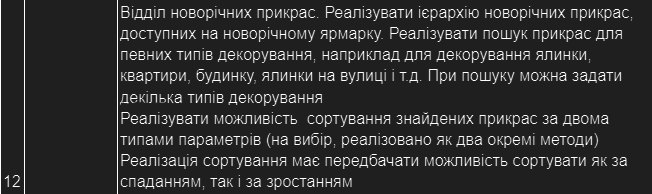

# Java labs for university

## All tasks

### 2 Class hierarchy

- orginise class hierarchy
- make "tests" using main class:
  - create a few objects of the classes

### 3 Filtering and sorting

- create class `Manager`
  - make sorting in descending order with Java built-in utils as well as insceding
  - make filtering by all fields

Use variant same as in previous laba
