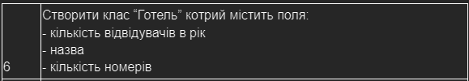

# The usniversity labs in Java language

## Tasks

### 1 Record introduction

- make Java console application `Hotel`  
- use `records`
- make static field and get method for it  
- make constructors and their chain  

### 2 Class hierarchy

- orginise class hierarchy
- make "tests" using main class:
  - create a few objects of the classes

### 3 Filtering and sorting

- create class `Manager`
  - make sorting in descending order with Java built-in utils as well as insceding
  - make filtering by all fields

Use variant same as in previous laba
